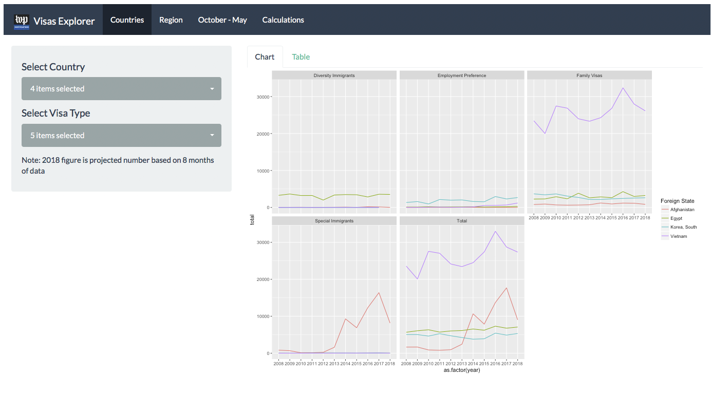

[This data is published under an [Attribution-NonCommercial-ShareAlike 4.0 International (CC BY-NC-SA 4.0) license](https://creativecommons.org/licenses/by-nc-sa/4.0/)]

## Immigrant Visas Explorer

----

R Shiny application to explore Immigrant Visa data from the U.S Department of State.

The department [releases data](https://travel.state.gov/content/travel/en/legal/visa-law0/visa-statistics.html) annually and monthy in PDFs.

The data has been scraped, cleaned, and organized in a downloadable format along with the app.

The repo can be downloaded and explored manuay or the application can be run locally with the following command: `shiny::runGitHub("immigrant-visas", "wpinvestigative")`

# About the folders in this repo

* **[scripts](scripts)** - Exploratory data analysis
* **[raw_data](raw_data)** - Raw data or consolidated spreadsheets from scraped PDFS
* **[output_data](output_data)** - Cleaned data transformed from raw data used for analysis and the Shiny App

